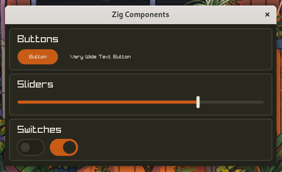
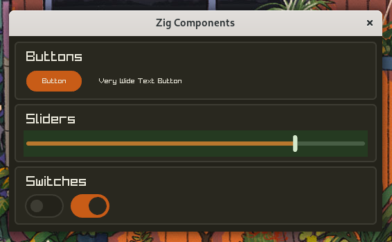

# zig components *kinda*

While these may seem native, don't be fooled... its just raylib.

long-term todo: Move to native rendering, and use something like cairo

also make flexbox like containers, eugh

## Currently implemented components

## Size Recalculation / Debug Mode

depicted with green rect toggle with <kdb>F5</kdb>

